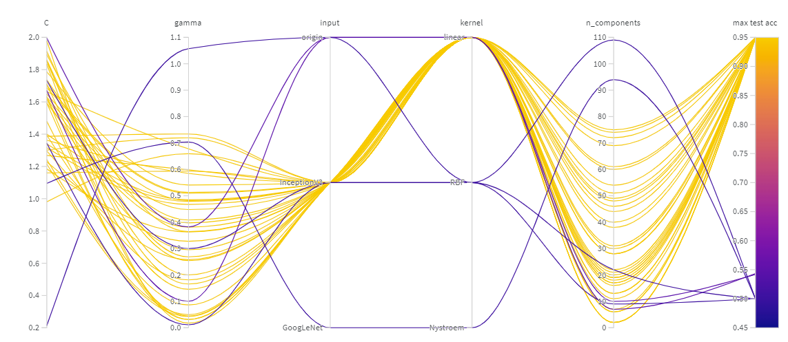
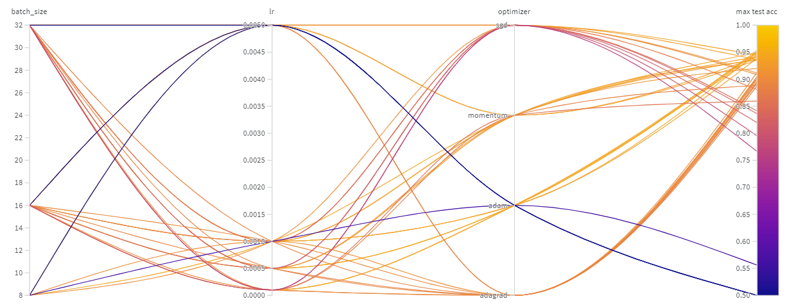
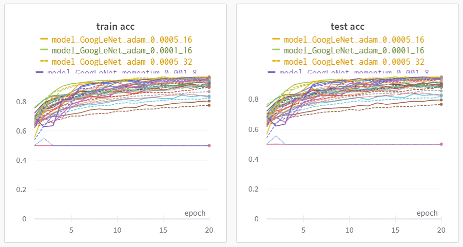
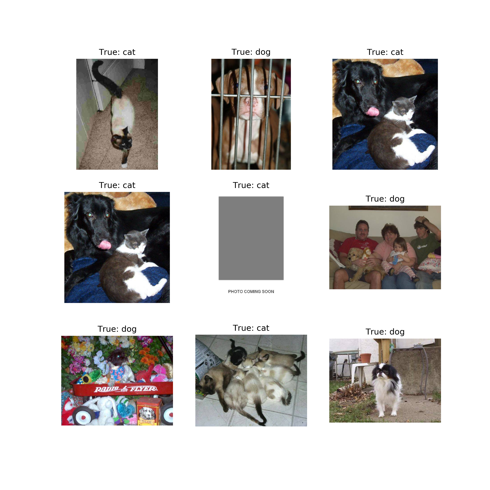

# MindSpore 构建 GoogLeNet 图像分类

GoogLeNet, InceptionV3, SVM

## Requirements

`pip install -r requirements.txt`

## Dataset

[https://www.kaggle.com/c/dogs-vs-cats](https://www.kaggle.com/c/dogs-vs-cats)

## Training

`python -m model_name -e epoch -w`

## Results

[https://wandb.ai/cugcuiyc/DLFIN](https://wandb.ai/cugcuiyc/DLFIN)

## Pretrained models

链接：https://pan.baidu.com/s/1IZiPRT21dyOgOJBFQPwzXg 
提取码：0cd0

| 模型 | 正确率 |
|  :----:|  :----: |
| model_GoogLeNet_best_param | 0.9486 |
| model_GoogLeNet_imp_best_param | 0.9906 |

## Contact
[cugcuiyc@126.com](mailto:cugcuiyc@126.com)